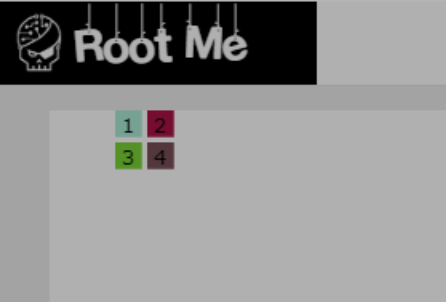

## [[Root-Me](https://www.root-me.org/)] [[Web-Client](https://www.root-me.org/en/Challenges/Web-Client/)] [[Flash - Authentication](https://www.root-me.org/en/Challenges/Web-Client/Flash-Authentication)] [[解题报告](https://exp-blog.com/safe/ctf/rootme/web-client/flash-authentication/)]

------

> 《[[[CTF 解题报告] Flash - Authentication.pptx](https://docs.google.com/presentation/d/e/2PACX-1vQmpph0Wrvgf53x8gPIwSfi43XwT--GvOiMEckNLYF0P39QhzLNFtI05pnjXSixSaJoZC0iqajnZWMS/pub?start=false&loop=false&delayms=3000)》

推理题。没错，这题的答案我是推理出来的。

打开挑战页面只有一个 flash 动画，里面只有 1、2、3、4 四个数字，通过点击数字进行输入密码。

通过连续输入某同一个数字测试发现，输入的规律如下：

- 最多输入 6 个数字，就会自动触发密码校验
- 数字 1、2、3 是有效输入
- 数字 4 从输入手感上像一个操作符

查看网页源码，可以发现在最后面隐藏了一段 JS 代码， 其作用是判断 Flash 的输出值是否等于 `dbbcd6ee441aa6d2889e6e3cae6adebe` ，很明显，只要我们输入某组数字得到这个值，那么这组数字就是最终密码。换言之，我们最终目标是反推 `dbbcd6ee441aa6d2889e6e3cae6adebe` 对应的输入值。

不难发现 `dbbcd6ee441aa6d2889e6e3cae6adebe` 很像一个 MD5 码，使用 [MD5Online](https://www.md5online.org/md5-decrypt.html) 进行解码，果然得到 6 个十六进制数 `41 41 95 51 95 AA` 。

只要对这段 JS 代码增加一个断点进行 DEBUG，可以在每次输入数字后，得到其对应的 MD5输出。

然后再使用 [MD5Online](https://www.md5online.org/md5-decrypt.html) 对每一次 DEBUG 得到的输出进行解码，最终我记录了这样的一个表（注意某些 MD5 码因为未被录入到解码表，无法解码，所以某些组合无法进行记录）：

| Flash输入 | 有效输入长度 | DEBUG得到的Flash输出（MD5码） | MD5解码（Hex） | 输出长度 |
|---:|:---:|:---:|:---|:---:|
| 111111 | 6 | fb86fbf268caac98db28f43acf074761 | BA BA BA BA BA BA | 12 |
| 14111111 | 6.5 | ebf17f28a242305db18bb9fbc69117c0 | BA BA BA BA BA BA A | 13 |
| 141411111 | 6 | c730a2449b24b5e5f0eb85d475b69338 | BA BA BA BA BA AA | 12 |
| 144111111 | 6.5 | ebf17f28a242305db18bb9fbc69117c0 | BA BA BA BA BA BA A | 13 |
| 1444111111 | 6.5 | ebf17f28a242305db18bb9fbc69117c0 | BA BA BA BA BA BA A | 13 |
| 4111111 | 6 | fb86fbf268caac98db28f43acf074761 | BA BA BA BA BA BA | 12 |
| 44111111 | 6 | fb86fbf268caac98db28f43acf074761 | BA BA BA BA BA BA | 12 |
| 222222 | 6 | 35e479a04fc03bb46654894acf742eea | 41 41 41 41 41 41 | 12 |
| 24222222 | 6.5 | 5aadf0f50aede2610eeb761bf3d52ea9 | 41 41 41 41 41 41 1 | 13 |
| 333333 | 6 | 7e137ba035238babe49ef64259e26513 | 95 95 95 95 95 95 | 12 |
| 123321 | 6 | 3f25d525a24dad071f17b93a2e1896d2 | BA 41 95 95 41 BA | 12 |
| 123123 | 6 | 4fc9d8d098b30fd9e3a1f8042b7f38c7 | 95 41 BA 95 41 BA | 12 |

> 用于分析的输入的数字组合，只能使用 MD5 解码平台已收录的组合，因此无法直接穷举得到任意数字组合的 MD5 解码后的十六进制串。

通过分析输入和输出，可以得到这样的规律：

- 输入 `数字1` 会得到十六进制输出 `BA`
- 输入 `数字2` 会得到十六进制输出 `41`
- 输入 `数字3` 会得到十六进制输出 `95`
- 改变的是输入头部，输出变化的位置是尾部，说明输出是输入的逆序
- `数字4` 会与前一个数字进行某种运算，改变其十六进制输出
- `数字4` 前面如果没有其他数字，相当于没有 `数字4` （即一开始就输入数字 4 是没意义的）
- 连续输入 `数字4`，等价于一个 `数字4`
- 输出长度默认是 12 ，当输入中存在的 `数字4` 为奇数个时（连续的 `数字4` 看成一个），输出长度会突破到 13
- 输入 `数字14` 会得到十六进制输出 `A`
- 输入 `数字1414` 会得到十六进制输出 `AA`
- 输入 `数字24` 会得到十六进制输出 `1`

由于最终的目标输出是 `41 41 95 51 95 AA`，根据此规律已经可以知道对应的输入数字串是 `2 2 3 ? 3 1414` 。

又由于输入和输出顺序是相反的，逆转输入数字串顺序得到 `1414 3 ? 3 2 2` 。

现在剩下的问题是：输出中的十六进制 `51` 应该对应输入的 `?` 是什么。 到这里开始只能靠脑洞联想，幸好组合情况不多。

从现象上看， `数字4` 的功能是截取前一个数字的十六进制数的 【低位】 ，而当 【低位】 有两个时，在输出中又会自动合并成一个完整的十六进制数，不然无法解释输出的十六进制位数的变化情况，因此我又有以下猜测：

- （已知）输入 `数字14` 会得到十六进制输出 `A`
- （已知）输入 `数字1414` 会得到十六进制输出 `AA`
- （已知）输入 `数字24` 会得到十六进制输出 `1`
- （推测）输入 `数字2424` 会得到十六进制输出 `11`
- （推测）输入 `数字34` 会得到十六进制输出 `5`
- （推测）输入 `数字3434` 会得到十六进制输出 `55`
- （猜测）实际上 `数字14` = `A`，`数字24` = `1`，`数字34` = `5`
- （猜测）因有顺逆序逻辑（但不清楚影响全局还是局部），输入 `数字2434` 或 `数字3424` 会得到十六进制输出 `51`

至此可推测，真正的密码只有两种可能： `1414 3 2434 3 2 2` 或 `1414 3 3424 3 2 2` 。

输入测试发现，前者 `141432434322` 就是正确答案，完成挑战。

> 其实这种解法有点取巧，因为刚好真正的密码组合比较简单而已，若是更复杂一点就会因为可能性过多而无法推测了。这题更靠谱的解法是反编译 Flash 的源码进行分析：可以下载题中的 Flash 得到 [`RootMe.swf`](RootMe.swf.zip) 文件，然后使用 SWF 反编译工具 [jpexs-decompiler](https://github.com/jindrapetrik/jpexs-decompiler/releases) 查看其源码进行加密原理分析，具体分析步骤见 [这里](https://offsecresearch.com/blog/2017/03/flash-authentication-brigandage/) （注意里面部分截图的说明是错的，例如 XOR 的原理，参考下思路就好） 。

------

## 版权声明

　[-EXP%202016-blue.svg)](http://exp-blog.com)　
  

- Site: [http://exp-blog.com](http://exp-blog.com) 
- Mail: <a href="mailto:289065406@qq.com?subject=[EXP's Github]%20Your%20Question%20（请写下您的疑问）&amp;body=What%20can%20I%20help%20you?%20（需要我提供什么帮助吗？）">289065406@qq.com</a>

------
